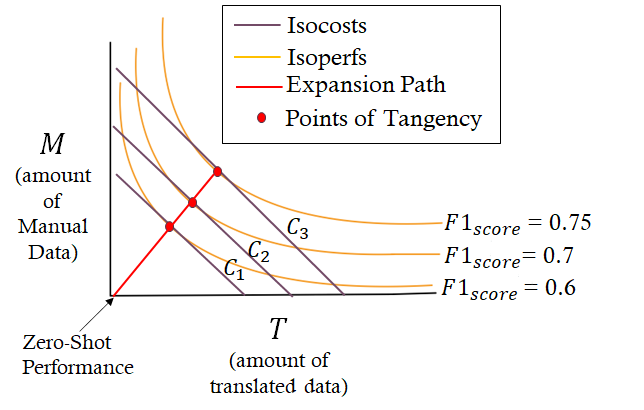

# PerformanceFunctionAnalysis

<h3 align="center"> On the Economics of Multilingual Few-shot Learning: Modeling the
Cost-Performance Trade-offs of Machine Translated and Manual Data </h3>

<h4 align="center"> Kabir Ahuja, Monojit Choudhury, Sandipan Dandapat </h4>

<p align="center">
  <a href="https://aclanthology.org/2022.naacl-main.98/"></a>
  <a href="https://arxiv.org/abs/2009.11264"></a>
  <a href="https://github.com/microsoft/PerformanceFunctionAnalysis/blob/main/LICENSE">
    
  </a>
</p>
Borrowing ideas from *Production functions* in micro-economics, in this paper we introduce a framework 
to systematically evaluate the performance and cost trade-offs between machine-translated and manually-created labelled data for task-specific fine-tuning of massively multilingual language models. We illustrate the effectiveness of our framework through a case-study on the TyDIQA-GoldP dataset. One of the interesting conclusions of the study is that if the cost of machine translation is greater than zero, the optimal performance at least cost is always achieved with at least some or only manually-created data. To our knowledge, this is the first attempt towards extending the concept of production functions to study data collection strategies for training multilingual models, and can serve as a valuable tool for other similar cost vs data trade-offs in NLP.

<h2 align="center">
  
</h2>

#### Dependencies
- Compatible with Python3.7
- The necessary packages can be install through requirements.txt.

#### Setup
Install VirtualEnv using the following (optional):

```shell
$ [sudo] pip install virtualenv
```
We recommend creating a virtual environment(optional):

```shell
$ virtualenv -p python3 venv
$ source venv/bin/activate
```
Finally, install the required packages by running:

```shell
pip install -r requirements.txt
```

#### Resources

We provide the Performance Data by training with 3080 different data configurations for TyDiQA-GoldP dataset as described in the paper. These can be found in `performance_data/tydiqa_mbert_results.csv`

These numbers were obtained by fine-tuning the Multilingual BERT or mBERT on TyDiQA-GoldP datasets by modifying the scripts provided in the [XTREME Benchmark](https://github.com/google-research/xtreme). We will make the modified scripts public soon.

#### Running Experiments

**Fitting and Evaluating Performance Functions**

To fit the AMUE and Gaussian Regression based Performance Function on the provided data and evaluate the wellness of fit, execute the following command
```bash
python -m src.main --mode fit_nd_eval --lang <LANG> --pivot_size <PIVOT SIZE>
```

Here `<LANG>` and `<PIVOT SIZE>` refers to the target language and size of the pivot (English) language data. For example:

```bash
# This command fits and evaluates the performance functions on Swahili with 3696 training examples available for English
python -m src.main --mode fit_nd_eval --lang sw --pivot_size 3696
```

Supported languages include: ar, bn, fi, id, ko, ru, sw, te

Supported Pivot Sizes include: 100, 500, 1000, 2000, 3000, 3696

One can also supply "all" for the two arguments to run experiments on all possible language and pivot size pairs

```bash
# This command fits and evaluates the performance functions on all supported language and pivot size pairs
python -m src.main --mode fit_nd_eval --lang all --pivot_size all
```

The results of the experiments will get stored in `outputs/fit_results`

**Generating Expansion Paths**

To generate Isoperf-Isocost plots with expansion paths as discussed in the paper, run the following command

```bash
# This command fits the AMUE performance function on Swahili with 3696 training examples available for English when the translated data is 10 times as cheap as manual data, and generates Expansion Curves
python -m src.main --mode fit_nd_eval --lang sw --pivot_size 3696 --c12 0.1 
```

Here `--c12` specifies the ratio of the unit costs of obtaining translated and manual data.

The generated plots will be stored in `outputs/exp_paths`

# Citation

If you use our code in this repo, please cite our paper `\cite{ahuja-etal-2022-economics}`.
```
@inproceedings{ahuja-etal-2022-economics,
    title = "On the Economics of Multilingual Few-shot Learning: Modeling the Cost-Performance Trade-offs of Machine Translated and Manual Data",
    author = "Ahuja, Kabir  and
      Choudhury, Monojit  and
      Dandapat, Sandipan",
    booktitle = "Proceedings of the 2022 Conference of the North American Chapter of the Association for Computational Linguistics: Human Language Technologies",
    month = jul,
    year = "2022",
    address = "Seattle, United States",
    publisher = "Association for Computational Linguistics",
    url = "https://aclanthology.org/2022.naacl-main.98",
    doi = "10.18653/v1/2022.naacl-main.98",
    pages = "1369--1384",
}
```


#### TODO
- [ ] Upload Fine-Tuning Scripts
